# OrbitQ Service


> Backend API service powering the [OrbitQ](https://orbitq.app) rocket launch tracker.

OrbitQ is an iOS app that lets users track upcoming rocket launches and receive push notifications when a launch's status or schedule changes — including real-time countdown alerts at 24 hours, 1 hour, and 5 minutes to launch. This repo is the backend service that powers it.

---

## Architecture

OrbitQ API sits between the iOS app and the upstream [Launch Library 2 (LL2)](https://thespacedevs.com/llapi) API. It caches responses to manage rate limits, persists tracking subscriptions, and runs background jobs to detect changes and dispatch push notifications via Expo.

```mermaid
graph TD
    App["📱 OrbitQ iOS App"]
    API["🖥️ OrbitQ API\n(Express / TypeScript)"]
    Redis["⚡ Redis\n(Upstash)"]
    PG["🗄️ PostgreSQL"]
    LL2["🚀 Launch Library 2\n(thespacedevs.com)"]
    Expo["📨 Expo Push\nNotifications"]

    App -->|"API requests (API-Key auth)"| API
    API -->|"Cache check"| Redis
    Redis -->|"Cache miss → fetch"| LL2
    LL2 -->|"Response cached"| Redis
    API -->|"Read/write tracking & snapshots"| PG
    API -->|"Send push notifications"| Expo
    Expo -->|"Push delivery"| App
```



---

## Tech Stack

| Layer              | Technology                                                                                          |
| ------------------ | --------------------------------------------------------------------------------------------------- |
| Runtime            | Node.js 20, TypeScript 5                                                                            |
| Web framework      | Express 4                                                                                           |
| Database           | PostgreSQL (via `pg`)                                                                               |
| Cache              | Upstash Redis (`@upstash/redis`)                                                                    |
| HTTP client        | [`underrated-fetch`](https://github.com/jamus/underrated-fetch) — fetch with built-in Redis caching |
| Push notifications | Expo Push Notifications SDK (abstracts APNs + FCM)                                                  |
| Error monitoring   | Sentry                                                                                              |
| Testing            | Vitest + Supertest                                                                                  |
| Deployment         | Railway (nixpacks)                                                                                  |

---

## How It Works

### 1 · API Request Flow

The iOS app requests launch data through the OrbitQ API rather than hitting LL2 directly. Every request checks Redis first — only fetching from LL2 on a cache miss. This keeps the app well within the LL2 rate limit while still serving fresh data.


Cache TTLs are tuned to the LL2 rate limit tier in use:

| Endpoint             | TTL    | Purpose                                     |
| -------------------- | ------ | ------------------------------------------- |
| `/launches/upcoming` | 4 min  | High-frequency; users check this most often |
| `/launches/:id`      | 10 min | Per-launch detail                           |
| `/launches/previous` | 15 min | Historical; changes infrequently            |

> 💡 **Design decision: static TTL over dynamic**
> An earlier iteration explored dynamic TTL — shortening cache expiry to ~60 seconds when a launch was within 30 minutes of its NET. This gave fresher data during countdowns but made rate-limit budgeting unpredictable: a cluster of near-launches could exhaust the hourly LL2 quota quickly. Static TTLs make the request budget deterministic and easy to reason about. The countdown notification system (which runs server-side and doesn't depend on cache freshness) closes the gap for time-critical alerts.

---

### 2 · Launch Change Detection & Push Notifications

The core feature. A background job runs every 4 minutes, compares the latest LL2 data against stored snapshots, and notifies subscribers when anything changes.

```mermaid
sequenceDiagram
    participant Job as Change Detect Job
    participant Cache as Redis Cache
    participant DB as PostgreSQL
    participant Expo as Expo Push
    participant App as 📱 iOS App

    Job->>Cache: Fetch upcoming launches (cached)
    Cache-->>Job: Launch list
    Job->>DB: Load tracked launch IDs + snapshots
    DB-->>Job: Snapshots

    loop For each tracked launch
        Job->>Job: Diff current vs. snapshot
        alt Change detected (status or schedule)
            Job->>DB: Update snapshot
            Job->>DB: Log notification
            Job->>Expo: Send push notification
            Expo-->>App: "Delayed 2h — Falcon 9 / Starlink"
        else No change
            Job->>DB: Update snapshot (last_checked)
        end
    end
```



Three notification types are sent when a change is detected:

| Type              | Trigger                  | Example message                                    |
| ----------------- | ------------------------ | -------------------------------------------------- |
| `status_update`   | Launch status changes    | _"Go for Launch — Falcon 9 / Starlink"_            |
| `schedule_change` | NET (launch time) shifts | _"Delayed 3h — New Shepard / NS-29"_               |
| `launch_update`   | Both change at once      | _"Status: TBD · Advanced 1d — Vulcan / Peregrine"_ |

> 💡 **Design decision: snapshot diffing over webhooks**
> LL2 doesn't offer webhooks, so change detection is polling-based. Rather than storing just a timestamp of the last check, the API persists a full snapshot of each tracked launch (status ID + name, NET, launch name). This makes the diff unambiguous — a change is detected the moment any field diverges from the stored value, with no risk of missing an update that happened and reverted between polls.

> 💡 **Design decision: bulk DB queries before the loop**
> All tracked launch IDs, their snapshots, and their subscribed device tokens are fetched in three queries _before_ the per-launch loop begins. The alternative — querying per launch inside the loop — would produce N+1 database round-trips for every job run. Upfront bulk fetching keeps the job's DB footprint constant regardless of how many launches are tracked.

---

### 3 · Countdown Notifications

Separately from change detection, a countdown monitor fires time-based alerts as a launch approaches. Thresholds are checked every 60 seconds.


If a launch slips past a threshold (e.g. delayed from T-30min to T+3h), the sent record is cleared so the notification will fire again when the window reopens.

> 💡 **Design decision: store `net_at_send` on countdown records**
> Each countdown record stores the NET (launch time) that was current when the threshold was marked sent. If the launch subsequently slips, the stored NET no longer matches the snapshot — the old record is deleted and the threshold becomes eligible to fire again. A simple boolean `sent` flag would make reschedule detection impossible without a separate comparison step.

---

## Background Jobs

Five jobs run independently in async loops managed by a central task scheduler. Each job completes before sleeping — no overlapping runs.

> 💡 **Design decision: async loops, not cron**
> Each job is a `while (!aborted)` loop that sleeps _after_ each run completes. This means a slow run simply delays the next one — the interval is measured from completion, not start. Cron-style scheduling (e.g. `node-cron`) fires at wall-clock times regardless of whether the previous run has finished, which can cause jobs to overlap and stack up under load. The loops are owned by an `AbortController`, so stopping them on `SIGTERM` is a single `.abort()` call with no timers to clear.

```mermaid
graph LR
    Scheduler["Task Scheduler\n(AbortController)"]

    Scheduler --> A["🔄 Change Detect\nevery 4 min"]
    Scheduler --> B["📸 Backfill Snapshots\nevery 30 sec"]
    Scheduler --> C["⏳ Countdown Monitor\nevery 60 sec"]
    Scheduler --> D["📬 Receipt Check\nevery 15 min"]
    Scheduler --> E["🧹 Housekeeping\nevery 1 hr"]

    A -->|"Diffs launch state,\nsends change alerts"| LL2["LL2 API / Cache"]
    B -->|"Fetches initial snapshot\nfor newly tracked launches"| LL2
    C -->|"Fires T-24h/1h/5m\ncountdown notifications"| PG["PostgreSQL"]
    D -->|"Validates Expo\npush receipts"| Expo["Expo API"]
    E -->|"Cleans orphaned tokens,\narchives old logs"| PG
```



> 💡 **Design decision: backfill as a separate fast job**
> The change detect job can only diff a launch against a snapshot that already exists. When a user tracks a new launch, there's no snapshot yet. Rather than special-casing this inside change detect, a dedicated backfill job runs every 30 seconds to create those first snapshots quickly. This also pre-marks any countdown thresholds that have already elapsed at the moment of tracking — so a user who starts tracking at T-2h won't receive a stale "24 hours to launch" notification.

---

## Testing

Tests are written with [Vitest](https://vitest.dev/) and [Supertest](https://github.com/ladjs/supertest). The focus is on the five background tasks, which contain the most business-critical logic. HTTP endpoints are covered by integration tests via Supertest; the task layer is tested in isolation with mocked dependencies.

### Task Coverage

| Task                   | Interval | What's tested                                                                                                                                                   |
| ---------------------- | -------- | --------------------------------------------------------------------------------------------------------------------------------------------------------------- |
| **Change Detect**      | 4 min    | Diff logic for status and schedule changes; correct notification type selected; snapshot updated after each diff; no notification sent when nothing changes      |
| **Backfill Snapshots** | 30 sec   | Snapshot created on first run for a newly tracked launch; elapsed countdown thresholds pre-marked as sent so stale alerts are suppressed at tracking time        |
| **Countdown Monitor**  | 60 sec   | Each threshold (24h, 1h, 5m) fires exactly once; threshold cleared and re-queued when a launch slips past its window; no duplicate sends within the same window |
| **Receipt Check**      | 15 min   | Expo error receipts detected and the corresponding device token flagged; successful receipts produce no side effects                                             |
| **Housekeeping**       | 1 hr     | Orphaned device tokens removed; old notification log entries archived; job is a no-op when nothing qualifies                                                    |

All five tasks are tested with an `AbortController` wired in so each test can stop the loop cleanly after a single iteration — no timers leak between tests.

### Approach

Database calls are replaced with in-memory stubs using Vitest's `vi.fn()`, and the Expo SDK is mocked at the module level. This keeps the tests fast (no real DB or network calls) while still exercising the full decision logic inside each job.

The change detect job gets the most coverage, including edge cases like:

- both status and NET changing simultaneously (`launch_update` type)
- a launch reverting to a previously seen state (no spurious re-notification)
- subscriber list being empty (job completes silently with no Expo calls)

> 💡 **Design decision: task tests over end-to-end tests**
> Background jobs are hard to drive end-to-end because their effects depend on timing, external APIs, and DB state. Unit-level task tests — with all I/O mocked — give faster feedback and make it straightforward to assert exactly which notifications were sent and which DB writes occurred, without the flakiness of real clock or network dependencies.

---

## API Endpoints

### Public

```
GET /api/health
```

```json
{
  "status": "ok",
  "timestamp": "2025-10-01T12:00:00.000Z"
}
```

### Protected (require `API-Key` header)

```
GET /api/v1/launches/upcoming
GET /api/v1/launches/previous
GET /api/v1/launches/:id
GET /api/v1/config/launch_statuses
```

Responses are proxied from Launch Library 2 and cached. Example for a single launch:

```json
{
  "id": "abc123",
  "name": "Falcon 9 | Starlink Group 10-4",
  "status": {
    "id": 1,
    "name": "Go for Launch"
  },
  "net": "2025-10-15T08:30:00Z",
  "launch_service_provider": {
    "name": "SpaceX"
  },
  "rocket": {
    "configuration": {
      "name": "Falcon 9"
    }
  }
}
```

### Tracking (require `API-Key` header)

```
POST   /api/v1/tracking           — Subscribe a device token to a launch
DELETE /api/v1/tracking/:launchId — Unsubscribe a device from a launch
GET    /api/v1/tracking           — List launches tracked by a device
```

Example subscribe request:

```http
POST /api/v1/tracking
API-Key: <key>
Content-Type: application/json

{
  "deviceToken": "ExponentPushToken[xxxxxxxxxxxxxxxxxxxxxx]",
  "launchId": "abc123"
}
```

---

## Database Schema


---

## Deployment

The service is deployed on [Railway](https://railway.app) using nixpacks for zero-config builds. Upstash provides serverless Redis with no infrastructure to manage. Errors are captured in Sentry with production-only DSN gating so local development stays clean.

Graceful shutdown is handled via `SIGTERM`/`SIGINT` — background jobs are stopped and the database connection is closed cleanly before the process exits.

> 💡 **Design decision: Upstash (serverless) Redis over a managed instance**
> Upstash bills per request rather than per hour, making it cost-effective at low traffic volumes. The HTTP-based client also means no persistent TCP connection to manage — important on Railway where the process may be restarted or scaled with no warm-up time. The trade-off is slightly higher per-request latency vs a co-located Redis instance, which is acceptable given the cache TTLs are measured in minutes.

---

## Related

- [OrbitQ iOS App](#) _(coming soon)_
- [underrated-fetch](https://github.com/jamus/underrated-fetch) — the HTTP + cache library used internally
- [Launch Library 2](https://thespacedevs.com/llapi) — the upstream rocket launch data source

## Authorship

This documentation was co-authored with Claude (Anthropic).
