# OrbitQ Service


> Backend API service powering the [OrbitQ](https://orbitq.app) rocket launch tracker.

OrbitQ is an iOS app that lets users track upcoming rocket launches and receive push notifications when a launch's status or schedule changes — including real-time countdown alerts at 24 hours, 1 hour, and 5 minutes to launch. This README describes the backend service that powers it.

---

## Architecture

OrbitQ API sits between the iOS app and the upstream [Launch Library 2 (LL2)](https://thespacedevs.com/llapi) API. It caches responses to manage rate limits, persists tracking subscriptions, and runs background jobs to detect changes and dispatch push notifications via Expo.

```mermaid
graph TD
    App["📱 OrbitQ iOS App"]
    API["🖥️ OrbitQ API\n(Express / TypeScript)"]
    Redis["⚡ Redis\n(Upstash)"]
    PG["🗄️ PostgreSQL"]
    LL2["🚀 Launch Library 2\n(thespacedevs.com)"]
    Expo["📨 Expo Push\nNotifications"]

    App -->|"API requests (API-Key auth)"| API
    API -->|"Cache check"| Redis
    Redis -->|"Cache miss → fetch"| LL2
    LL2 -->|"Response cached"| Redis
    API -->|"Read/write tracking & snapshots"| PG
    API -->|"Send push notifications"| Expo
    Expo -->|"Push delivery"| App
```



---

## Tech Stack

| Layer              | Technology                                                                                                                                                          |
| ------------------ | ------------------------------------------------------------------------------------------------------------------------------------------------------------------- |
| Runtime            |  Node.js 20,  TypeScript 5 |
| Web framework      |  Express 4                                                                                               |
| Database           |  PostgreSQL (via [`pg`](https://github.com/brianc/node-postgres))                              |
| Cache              |  Upstash Redis (`@upstash/redis`)                                                                 |
| HTTP client        | 🐶 [`underrated-fetch`](https://github.com/jamus/underrated-fetch) — fetch with built-in Redis caching                                                              |
| Push notifications |  Expo Push Notifications SDK (abstracts APNs + FCM)                                                         |
| Error monitoring   |  Sentry                                                                                            |
| Testing            |  Vitest + Supertest                                                                                |
| Deployment         |  Railway (nixpacks)                                                                                      |

---

## How It Works

### 1 · API Request Flow

The iOS app requests launch data through the OrbitQ API rather than hitting LL2 directly. Every request checks Redis first — only fetching from LL2 on a cache miss.


> 💡 **Design decision: static TTL over dynamic**
> An earlier iteration explored dynamic TTL — shortening cache expiry when a launch was within 30 minutes of its NET. This gave fresher data during countdowns but made the code very difficult to reason about. Static TTLs make the request budget deterministic and easy to reason about. Will monitor if we need to shorten the caches (and increase our rate LL2 limit) over time.

---

### 2 · Launch Change Detection & Push Notifications

The core feature. A background job runs every 4 minutes, compares the latest LL2 data against stored snapshots, and notifies subscribers when anything changes.

```mermaid
sequenceDiagram
    participant Job as Change Detect Job
    participant Cache as Redis Cache
    participant DB as PostgreSQL
    participant Expo as Expo Push
    participant App as 📱 iOS App

    Job->>Cache: Fetch upcoming launches (cached)
    Cache-->>Job: Launch list
    Job->>DB: Load tracked launch IDs + snapshots
    DB-->>Job: Snapshots

    loop For each tracked launch
        Job->>Job: Diff current vs. snapshot
        alt Change detected (status or schedule)
            Job->>DB: Update snapshot
            Job->>DB: Log notification
            Job->>Expo: Send push notification
            Expo-->>App: "Schedule Change · Falcon 9 Block 5 / Starlink / Delayed 2 hours"
        else No change
            Job->>DB: Update snapshot (last_checked)
        end
    end
```



Three notification types are sent when a change is detected:

| Type              | Trigger                  | Title             | Example body                                                                                   |
| ----------------- | ------------------------ | ----------------- | ---------------------------------------------------------------------------------------------- |
| `status_update`   | Launch status changes    | `Status update`   | _"Falcon 9 Block 5 \nStarlink Group 6-14 \nGo for Launch"_                                     |
| `schedule_change` | NET (launch time) shifts | `Schedule Change` | _"Falcon 9 Block 5 \nStarlink Group 6-14 \nDelayed 2 hours"_                                   |
| `launch_update`   | Both change at once      | `Launch update`   | _"Falcon 9 Block 5 \nStarlink Group 6-14 \nStatus: Go for Launch \nSchedule: Delayed 2 hours"_ |

> 💡 **Design decision: snapshot diffing over webhooks**
> LL2 doesn't offer webhooks, so change detection is polling-based. Rather than storing just a timestamp of the last check, the API persists a full snapshot of each tracked launch (status ID + name, NET, launch name). This makes the diff unambiguous — a change is detected the moment any field diverges from the stored value, with no risk of missing an update that happened and reverted between polls.

>  **N+1 issue identified with Claude.**
> All tracked launch IDs, their snapshots, and their subscribed device tokens are fetched in three queries _before_ the per-launch loop begins. The alternative — querying per launch inside the loop — would produce N+1 database round-trips for every job run. Upfront bulk fetching keeps the job's DB footprint constant regardless of how many launches are tracked.

---

### 3 · Countdown Notifications & Push Notifications

Separately from change detection, a countdown monitor fires time-based alerts as a launch approaches. Thresholds are checked every 60 seconds.

```mermaid
sequenceDiagram
    participant Job as Countdown Monitor (60s)
    participant DB as PostgreSQL
    participant Expo as Expo Push
    participant App as 📱 iOS App

    Job->>DB: Load tracked launches + snapshots
    loop For each tracked launch
        Job->>Job: Calculate time until launch
        alt Within 24h threshold (not yet sent)
            Job->>Expo: "NET · Falcon 9 Block 5 / Starlink / 24 hours till launch"
            Expo-->>App: Push notification
            Job->>DB: Mark 24h threshold sent
        else Within 1h threshold (not yet sent)
            Job->>Expo: "NET · Falcon 9 Block 5 / Starlink / 1 hour till launch"
            Expo-->>App: Push notification
            Job->>DB: Mark 1h threshold sent
        else Within 5m threshold (not yet sent)
            Job->>Expo: "NET · Falcon 9 Block 5 / Starlink / 5 minutes till launch"
            Expo-->>App: Push notification
            Job->>DB: Mark 5m threshold sent
        end
    end
```



If a launch slips past a threshold (e.g. delayed from T-30min to T+3h), the sent record is cleared so the notification will fire again when the window reopens.

> 💡 **Design decision: store `net_at_send` on countdown records**
> Each countdown record stores the NET (launch time) that was current when the threshold was marked sent. If the launch subsequently slips, the stored NET no longer matches the snapshot — the old record is deleted and the threshold becomes eligible to fire again.

---

## Background Jobs

Five jobs run independently in async loops managed by a central task scheduler. Each job completes before sleeping — no overlapping runs.

> 💡 **Design decision: async loops, not cron**
> Each job is a `while (!aborted)` loop that sleeps _after_ each run completes. This means a slow run simply delays the next one — the interval is measured from completion, not start. Cron-style scheduling (e.g. `node-cron`) would fire at "wall-clock" times regardless of whether the previous run has finished. This could cause jobs to overlap up under load.

```mermaid
graph LR
    Scheduler["Task Scheduler | (AbortController)"]

    Scheduler --> A["🔄 Change Detect | every 4 min"]
    Scheduler --> B["📸 Backfill Snapshots | every 30 sec"]
    Scheduler --> C["⏳ Countdown Monitor | every 60 sec"]
    Scheduler --> D["📬 Receipt Check | every 15 min"]
    Scheduler --> E["🧹 Housekeeping | every 1 hr"]

    A -->|"Diffs launch state, | sends change alerts"| LL2["LL2 API / Cache"]
    B -->|"Fetches initial snapshot | for newly tracked launches"| LL2
    C -->|"Fires T-24h/1h/5m | countdown notifications"| PG["PostgreSQL"]
    D -->|"Validates Expo | push receipts"| Expo["Expo API"]
    E -->|"Cleans orphaned tokens, archives old logs"| PG
```



> 💡 **Design decision: backfill as a separate fast job**
> The change detect job can only diff a launch against a snapshot that already exists. When a user tracks a new launch, there's no snapshot yet. Rather than special-casing this inside change detect, a dedicated backfill job runs every 30 seconds to create those first snapshots quickly.

---

## Testing

Tests are written with [Vitest](https://vitest.dev/) and [Supertest](https://github.com/ladjs/supertest). The focus is on the five background tasks, which contain the most business-critical logic. HTTP endpoints are covered by integration tests via Supertest; the task layer is tested in isolation with mocked dependencies.

### Task Coverage

| Task                   | Interval | What's tested                                                                                                                                                   |
| ---------------------- | -------- | --------------------------------------------------------------------------------------------------------------------------------------------------------------- |
| **Change Detect**      | 4 min    | Diff logic for status and schedule changes; correct notification type selected; snapshot updated after each diff; no notification sent when nothing changes     |
| **Backfill Snapshots** | 30 sec   | Snapshot created on first run for a newly tracked launch; returns false when no launches are missing snapshots                                                  |
| **Countdown Monitor**  | 60 sec   | Each threshold (24h, 1h, 5m) fires exactly once; threshold cleared and re-queued when a launch slips past its window; no duplicate sends within the same window |
| **Receipt Check**      | 15 min   | Expo error receipts detected and the corresponding device token flagged; successful receipts produce no side effects                                            |
| **Housekeeping**       | 1 hr     | All four cleanup queries always run; returns true when any removed rows, false when all return 0                                                                |

 **Claude was used to generate tests**

---

## API Endpoints

### Protected (require `API-Key` header)

```
GET /api/v1/launches/upcoming
GET /api/v1/launches/previous
GET /api/v1/launches/:id
GET /api/v1/config/launch_statuses
```

Responses are proxied from Launch Library 2 and cached.

### Tracking (require `API-Key` header)

```
POST   /api/v1/tracking           — Subscribe a device token to a launch
DELETE /api/v1/tracking/:launchId — Unsubscribe a device from a launch
GET    /api/v1/tracking           — List launches tracked by a device
```

---

## Database Schema


---

## Deployment

The service is deployed on [Railway](https://railway.app) using nixpacks for zero-config builds. Upstash provides serverless Redis with no infrastructure to manage. Errors are captured in [Sentry](https://sentry.io/).

---

## Related

- [OrbitQ iOS App](#) _(public readme coming soon)_
- [underrated-fetch](https://github.com/jamus/underrated-fetch) — the HTTP + cache library used internally
- [Launch Library 2](https://thespacedevs.com/llapi) — the upstream rocket launch data source

## Authorship

 This documentation was co-authored with Claude (Anthropic).
